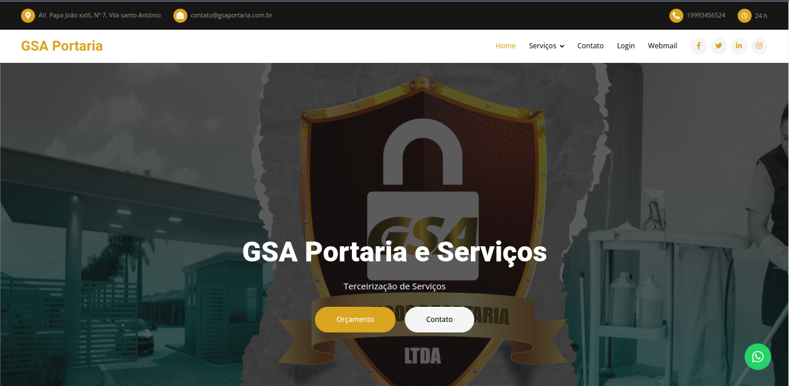
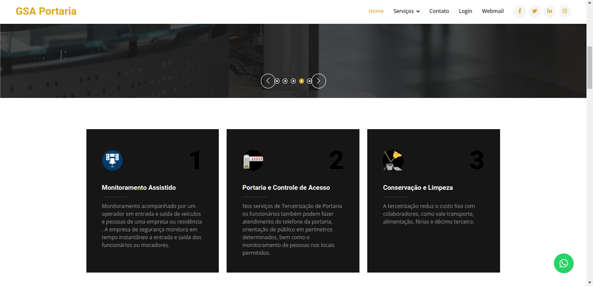
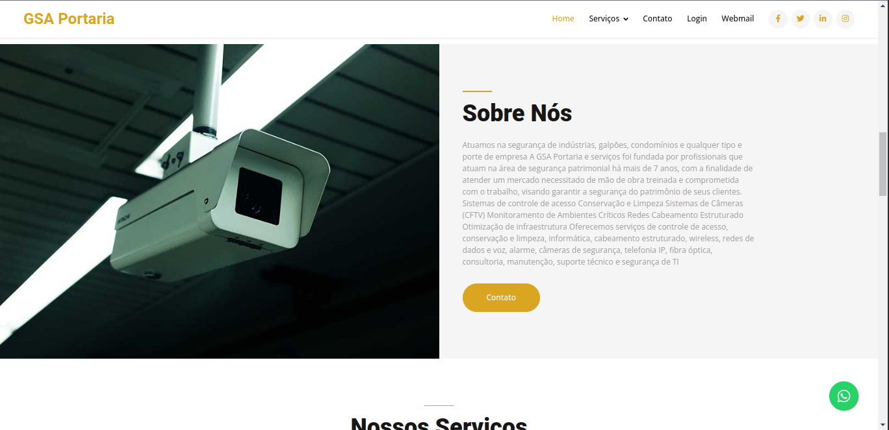
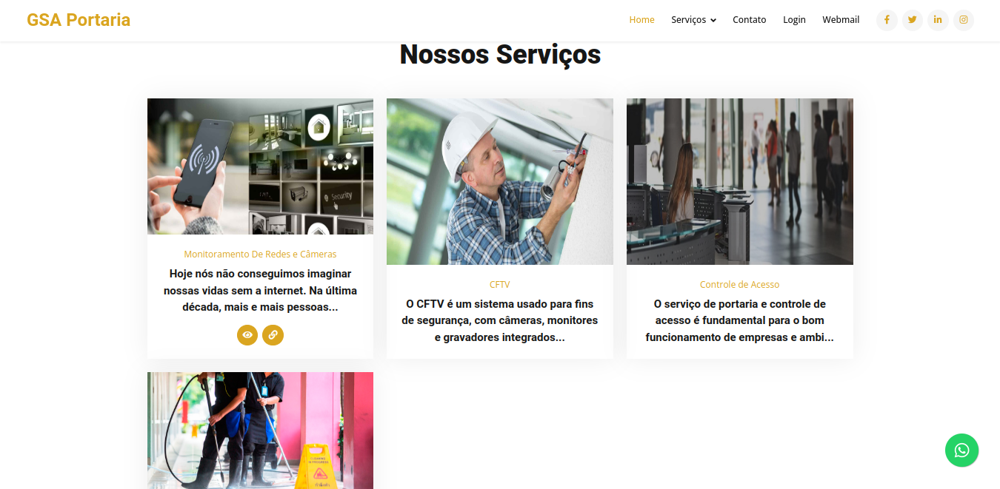
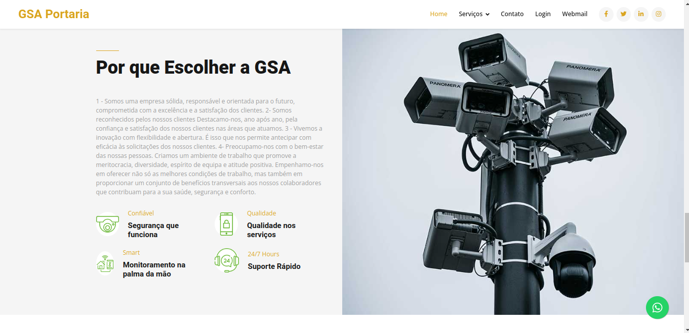
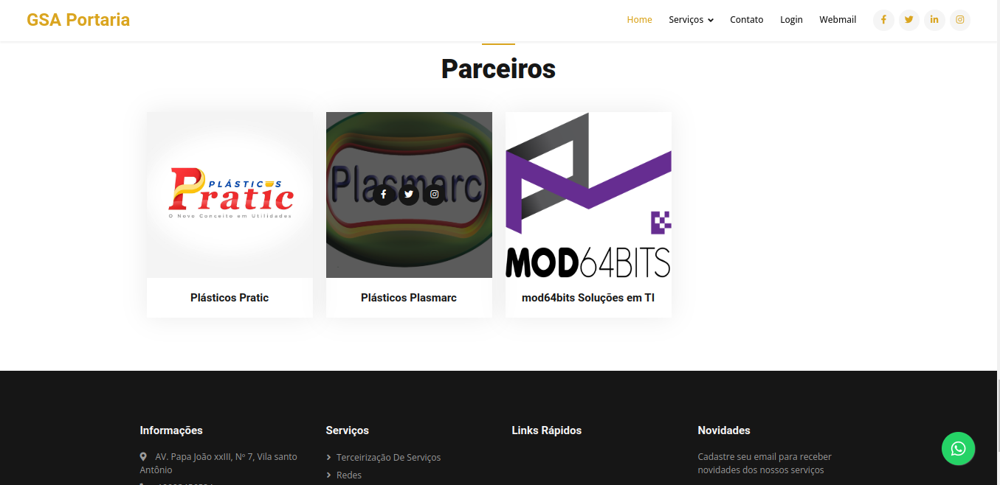
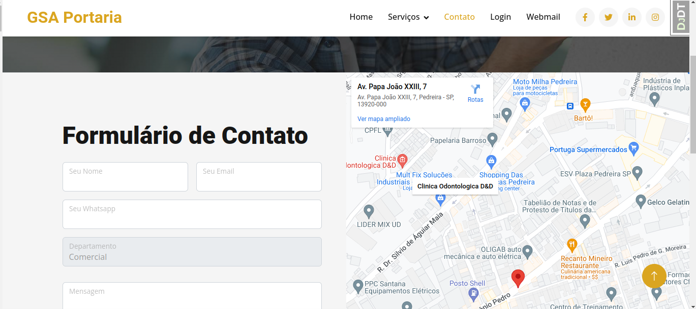
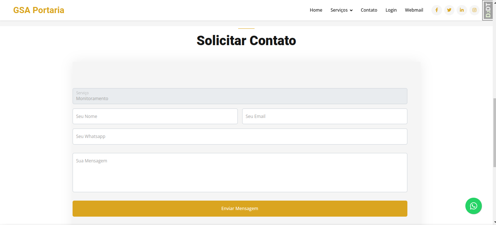

# GSA Portaria e Serviços

Cliente GSA Portaria e serviços

## 🔧 Funções

- Home
- Contato
- Solicitação de Orçamento
- Controle de ronda com leitor de Qrcode [ ] em desenvolvimento

## 💻 Projeto
Projeto para empresa gsa portaria

## 👨‍💻 Tecnologias Utilizadas

> - Python
> - Javascript

## 📜 Conteúdo
Para Mais Informações acesse:

✉ mod64bits@gmail.com

# Screenshots

